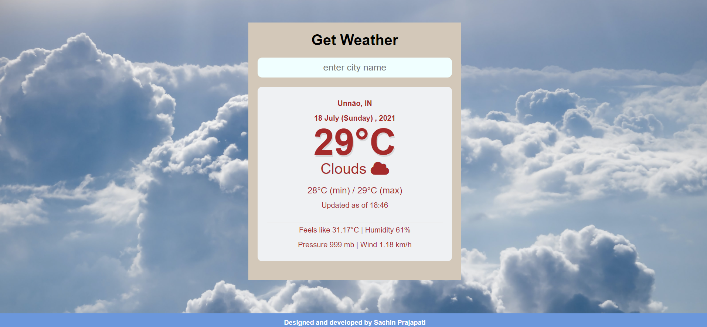

# 🌤️ Weather WebApp

## Overview

This web application provides real-time weather data using the OpenWeather API. Built with HTML, CSS, and JavaScript, the app features dynamic weather updates, including temperature, background images, and weather icons based on the current weather conditions.

🔗 **[Live Demo](http://vatsshubham100.github.io/Weather_App/)**

## 🛠 Features

- **Dynamic Weather Data**: Displays current temperature, min/max temperature, and more.
- **Dynamic Background Images**: Changes background images based on weather status.
- **Dynamic Weather Icons**: Updates weather icons according to the current weather conditions.
- **Basic Weather Information**: Includes additional details like feels-like temperature, humidity, pressure, and wind speed.
- **Input Validation**: Ensures that the input field is not empty.
- **Error Handling**: Provides alerts if the entered city name does not match with the API data.
- **User Experience**: Designed with a focus on good UX/UI.

## 📸 Snapshots

### Default View


### Valid City Input


### Empty Input


### City Not Found


## 🚀 Deployment

The project is deployed using GitHub Pages.

## 📖 Installation

To run this project locally, follow these steps:

1. **Clone the repository:**

   ```bash
   git clone https://github.com/vatsshubham100/Weather_App.git
   cd Weather_App
